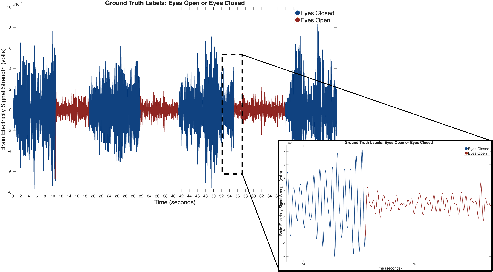

# Decode-Brain-Waves-with-Machine-Learning

This repository contains an activity where students will first learn how to interpret EEG signals and practice labeling data by hand to determine when a subject’s eyes are open or closed. Then, they will build and test a simple machine learning model in MATLAB using the k-nearest neighbor algorithm to classify EEG data automatically and compare its accuracy to their own predictions.

## Learning Objectives
In this activity, students will:
- Understand the basics of EEG signals and how they can indicate whether eyes are open or closed.
- Learn what features are in data and how feature extraction (like signal strength) helps classify EEG patterns.
- Explore how machine learning works by training a computer to recognize patterns in EEG data using the k-nearest neighbor algorithm.
- Practice building and testing a simple machine learning model to classify EEG data automatically.
- Evaluate and compare the accuracy and efficiency of human labeling vs. computer predictions.

## Set-up
**Required MathWorks® Products (https://www.mathworks.com)**

- [MATLAB](https://www.mathworks.com/products/matlab.html)

**Other Materials**
- Printed Activity Handout
- Colored markers or pens

## Instructions
1. Open the Live Script titled: "EEG_Classification_Activity.mlx".
2. Review introductory material on EEG data included in the Live Script.
3. Instruct students to complete the activity handout ("EEG_Classification_Activity_Handout.pdf") and practice classifying EEG signals by hand (Part 1 of the Live Script). Once students have completed the activity, have students pair up or group up to discuss similarities or differences in how they classified the EEG signals.
4. Guide students through Parts 2 and 3. Students will practice building, testing, and evaluating a simple machine learning model to classify EEG data in MATLAB.
5. Guide students through the discussion (Part 4) to compare and contrast human labeling versus machine learning classification.

## License

The license is available in the License.txt file in this GitHub repository.

## Community Support

[MATLAB Central](https://www.mathworks.com/matlabcentral/)

Copyright 2025 The MathWorks, Inc.
